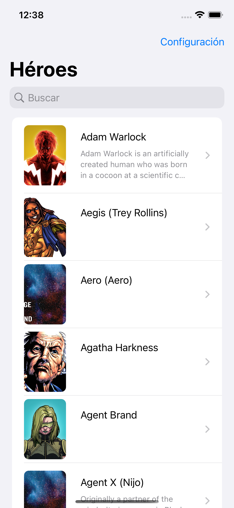

# marvelios
Marvel App made with SwiftUI, MVVM, Combine

## Features:
- MVVM
- Combine
- SwiftUI
- Clean Architecture
- Realtime Localization
- Theme Switcher
- Repository and Dependency Injection Design Patterns
- Unit Testing: Network Layer, CoreData, Repository, JSON Decodable

## TODO: 
- [x] The app must show the list of Comics of the character: image + name
(Horizontal scroll view)
- [ ] The app must show the list of Events of the character: image + name
(Horizontal scroll view)
- [ ] The app must show the list of Series of the character: image + name
(Horizontal scroll view)
- [ ] Snapshot tests
- [ ] UI tests
- [ ] Mock

## Dependencies:
- [Backed Decobale](https://github.com/jegnux/BackedCodable) property wrappers for nested JSON.
- [OHTTPS:](https://github.com/AliSoftware/OHHTTPStubs) framework for stubbing network requests.
- [SnapshotTesting:](https://github.com/pointfreeco/swift-snapshot-testing) Swift snapshot testing.
- [CachedAsyncImages:](https://github.com/lorenzofiamingo/swiftui-cached-async-image) Wrapper for Apple’s AsyncImage class
     to cache images.

## Screenshots

